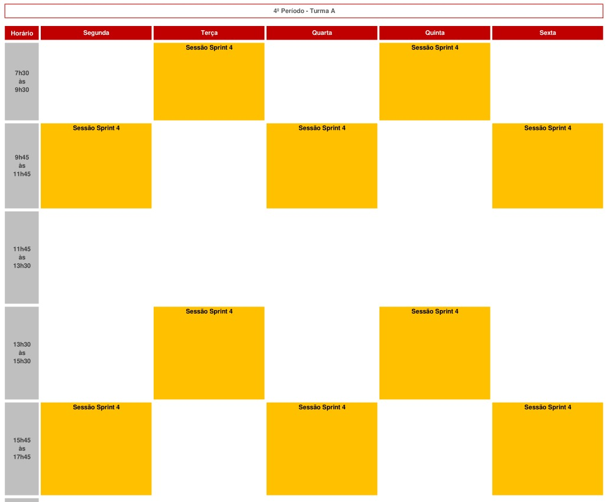

# Agenda 

Esta *sprint session* tem início em 19/05/2025 e termina em 06/06/2025. 

No dia XX/XX/XXXX das YY:YY às ZZ:ZZ teremos uma reunião inicial com a equipe do Mercado Livre. O escopo desta reunião é a apresentação do problema e objetivos do projeto. A presença de todos os membros da equipe é obrigatória.

A execução da sprint é 100% presencial. No calendário abaixo estão marcados os horários que todos os membros de todas as equipes devem estar presentes. 

Durante os horários que estão em amarelo qualquer professor poderá fazer a chamada em qualquer horário. A presença e participação do desenvolvimento em sala de aula será um dos critérios de avaliação da sprint.

Todos os membros de todas as equipes devem estar preparados para trabalhar entre 6 até 8 horas por dia no projeto.

## Calendário de entregas e marcos do projeto

Abaixo são listados algumas datas importantes para esta sprint: 

* 19/05/2025 - Início da sprint.
* XX/XX/XXXX - Reunião com o Mercado Livre.
* 22/05/2025 às 13:30 - Check-point com a equipe do Mercado Livre.
* 29/05/2025 às 13:30 - Check-point com a equipe do Mercado Livre.
* 05/06/2025 - Entrega do projeto. O horário ainda será definido. 

## Ferramenta de comunicação assincrona com a equipe do Mercado Livre

Vamos utilizar o XXXX para isto. 

